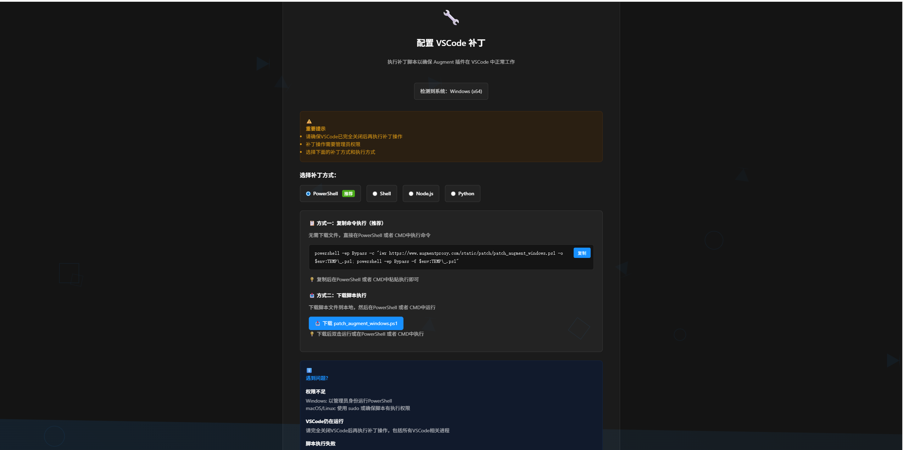
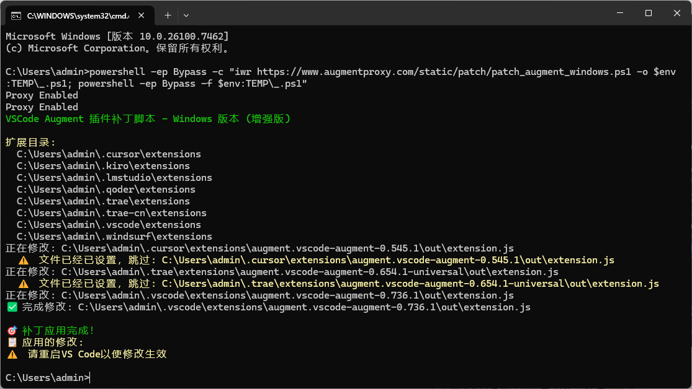
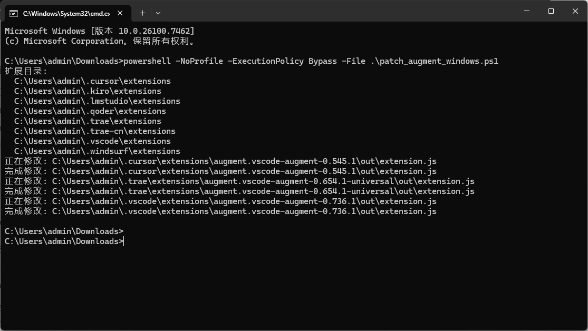
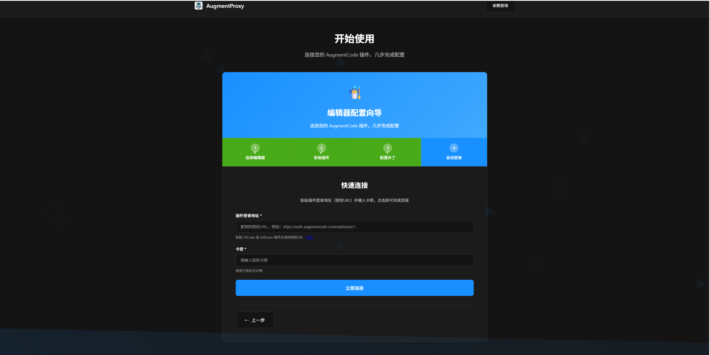
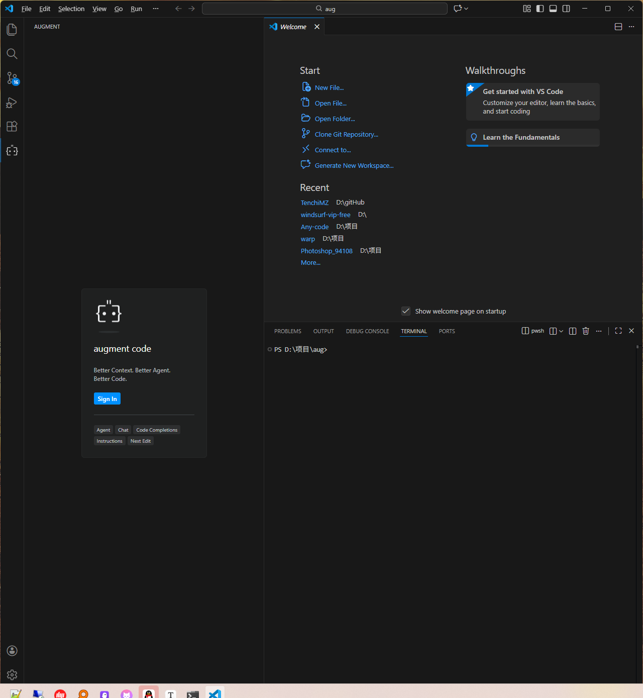
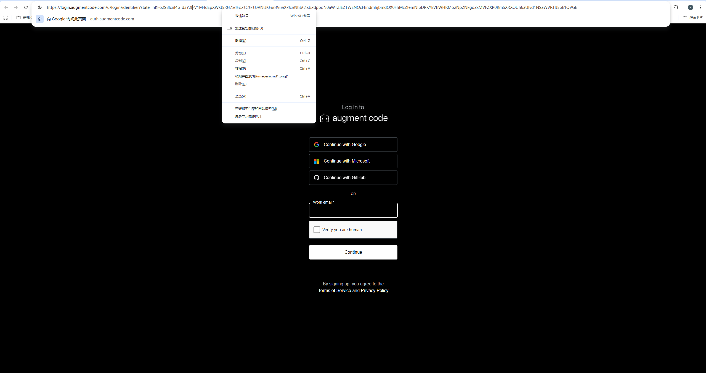
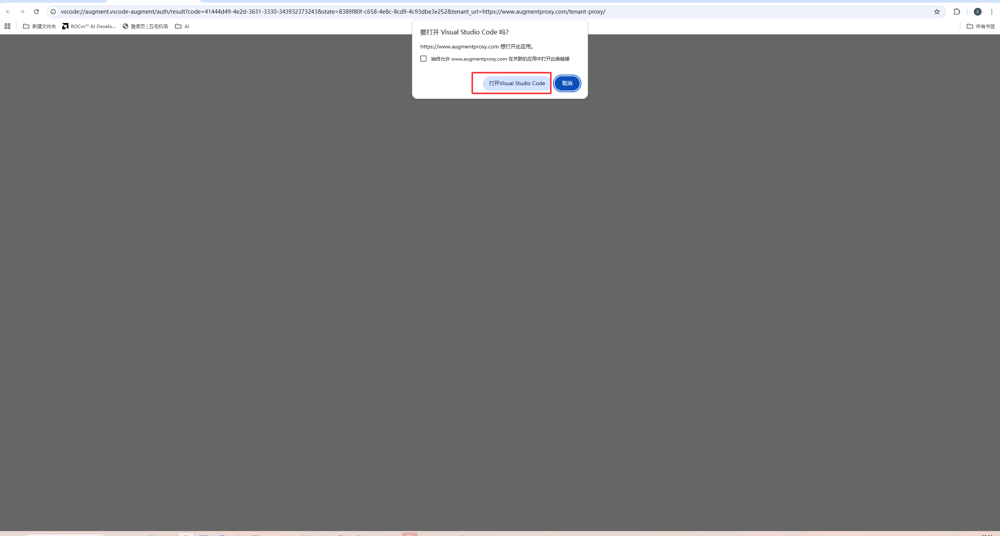
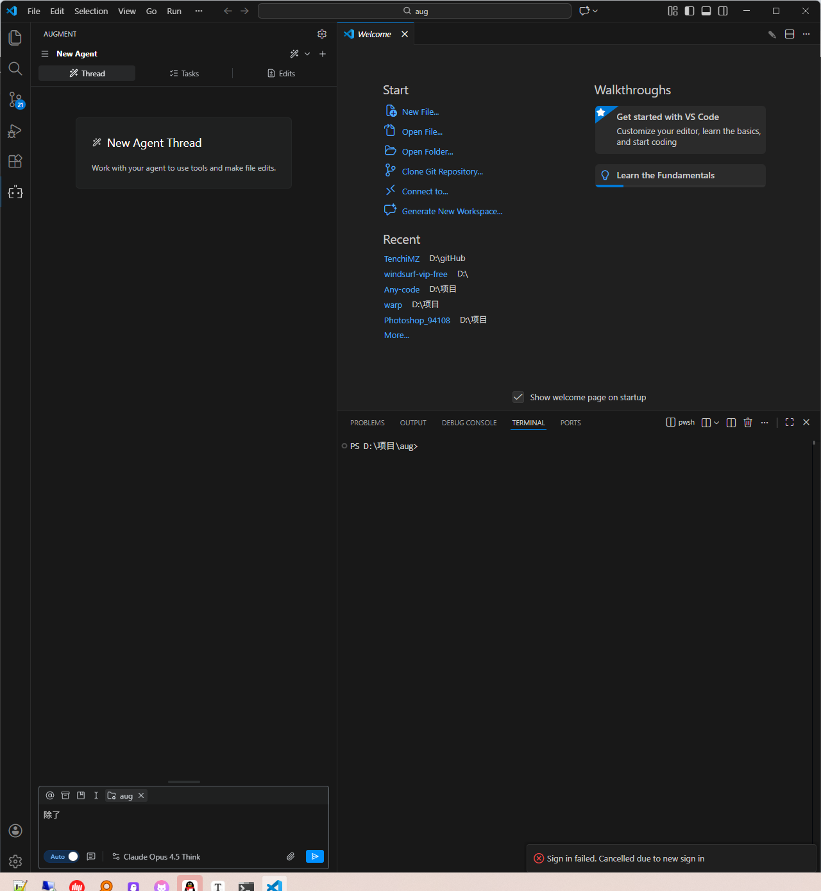
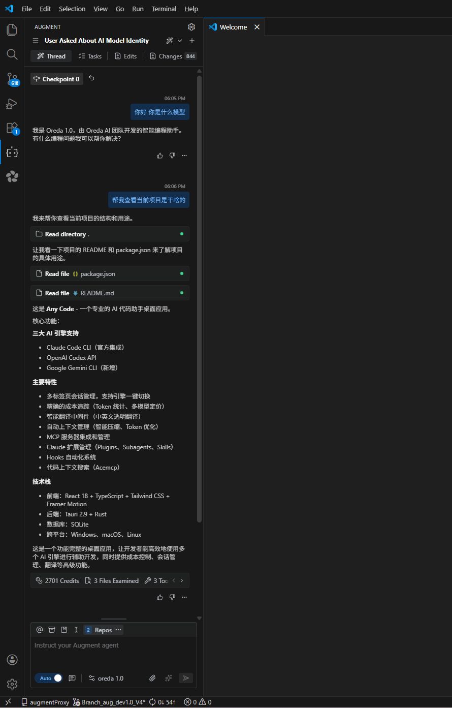

# VsCode / IDEA 使用 AugmentProxy 操作手顺
## QQ群

## 微信群


## 一、VsCode 使用说明

### 1. 打开官网

访问以下网址：  
https://www.augmentproxy.com/


点击 **「开始使用」**。

---

### 2. 执行 VSCode 补丁 🛑管理员身份运行命令

请按照 **VSCode 补丁页面**中的说明执行补丁，补丁有两种执行方式：

#### 方式一（推荐）



1. 打开 **CMD**
2. 复制 VSCode 补丁页面中 **方式一** 提供的命令
3. 粘贴并执行该命令



> 若执行过程中出现错误，请使用方式二。

---

#### 方式二（备用）

1. 下载补丁脚本文件：
   - `patch_augment_windows.ps1`
2. 打开 **PowerShell**
3. 切换到脚本所在目录
4. 执行以下命令：

```powershell
powershell -NoProfile -ExecutionPolicy Bypass -File ./patch_augment_windows.ps1
```



---

### 3. 重启 VSCode

⚠️ **补丁执行完成后，必须重启 VSCode 才能生效。**

---

### 4. 登录 AugmentProxy

1. 进入我们官网的 **开始使用** 页面



2. 打开VsCode中的augment插件，点击sign



3. 弹出的aug登录页面，等进入登录页面后，在链接栏右键撤销



4. 复制带有 `http://auth.augmentcode.com/authorize`的链接

5. 输入以下信息进行登录：

- 登录 URL
- 卡密



登录成功后即可正常使用。

登录成功


开始使用：




---

## 二、IDEA 使用说明

- **IDEA 无需执行补丁**
- 其余操作步骤与 **VSCode 完全一致**：
  1. 打开官网并进入开始使用页面
  2. 输入登录 URL 和卡密进行登录

---

## 三、🛑 注意事项

- 🛑补丁仅适用于 **VSCode或者其他基于VsCode开发的IDE**
- 🛑管理员身份运行命令
- 🛑执行补丁前请确保已关闭 VSCode
- 🛑若 PowerShell 权限受限，请使用方式二（Bypass 模式）

